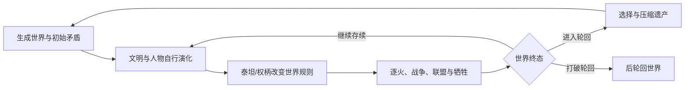
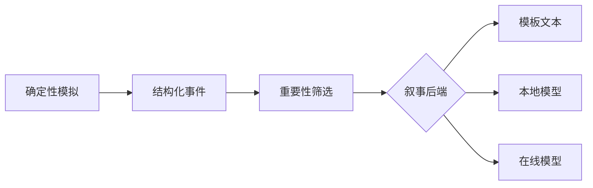

# 初步游戏设计文档

状态：草案 0.1  
最后更新：2026-09-04

## 1. 游戏定义

类型：神话文明模拟 / 观察型沙盒 / 跨轮回叙事  
默认模式：单机、离线可运行  
主要表现：2D格子地图、符号化人物、时间轴与历史档案

玩家不是传统意义上的救世主。玩家可以观察、关注、赐予有限启示，并在轮回边界保存少量遗产。世界其余部分由相互独立但可组合的规则推进。

默认开局采用“正史起始世界”：原作中的泰坦、城邦、黑潮和逐火压力构成世界初始条件；原作主线的固定人物命运、开拓者干预和永劫回归不构成必经剧本。

## 2. 核心循环



## 3. 模拟层级

### 世界层

- 地形、区域、资源、气候和昼夜；
- 黑潮/灾变的产生、扩散和抑制；
- 城市、道路、遗迹和生态承载力；
- 全局时间与局部规则修正。

### 文明层

- 人口、资源、制度、信仰和军事；
- 城邦关系：合作、依附、敌对、战争；
- 派系与社会态度；
- 对泰坦、逐火和轮回的集体认知。

### 人物层

重要人物包含：

```text
身份 / 年龄 / 能力 / 性格倾向 / 欲望 / 恐惧
关系 / 记忆 / 信念 / 誓言 / 创伤 / 声望 / 当前计划
```

普通人口以群体统计存在。当普通人经历重大事件、获得权柄、建立高强度关系或被玩家关注时，可晋升为完整人物。完整人物死亡后仍可以作为记忆、传说或灵魂遗产继续影响世界。

### 十二因子层

十二因子是实验世界中十二种生命原动力的简化模型。它们是人物、群体、城邦与权柄行为的底层倾向，不是攻击力、职业或固定剧本标签。

首版因子词表采用：毁灭、记忆、智识、同谐、欢愉、虚无、巡猎、纯美、存护、均衡、秩序、不朽。正式名称、原作映射与文本依据须进入设定考据库后才可锁定。

每个模拟对象持有一组可随经历变化的因子值。因子值通过欲望、恐惧、价值判断与行动权重间接影响选择；资源、关系、创伤、记忆、随机事件与局势同样参与决策。因子不能单独强制角色行动。

```text
十二因子倾向
  -> 欲望 / 恐惧 / 价值判断 / 行动候选权重
  -> 个体行为与人物关系
  -> 组织制度、城邦文化与泰坦权柄走向
  -> 事件链与世界终态
```

“黄金裔”是可涌现的世界身份，而非固定角色名单：当一个个体对某一因子形成极高且稳定的共鸣，并以经历与选择将其显现为生命核心时，可被世界、社会或泰坦识别为黄金裔。原作十二人是正史起始世界中的重要高共鸣实例，但不保证其命运、资格或存续。

### 泰坦与权柄层

```text
泰坦 = 权柄规则 + 当前人格 + 物质载体
```

- 权柄：定义自然或社会规律；
- 人格：决定权柄如何被解释和使用；
- 载体：可以被封印、杀死、替换或分裂；
- 三者允许分离、转移和重新组合。

继承某一泰坦火种/权柄不能由单项因子阈值自动决定。继承资格由对应因子共鸣、与权柄一致的经历和行为、火种状态、仪式/地点/时代等外部条件，以及继承者愿意承担的代价共同决定。因而原作黄金裔可能拒绝、失败或被取代；新的黄金裔也可能出现。多重高共鸣者可引发权柄竞争、兼容或冲突。

首个原型仅实现三类权柄：

1. 生灭：影响死亡、出生和亡者残留；
2. 理性：影响知识传播、决策误差和制度稳定；
3. 天时：影响昼夜、气候和灾害暴露。

名称为开发占位符；正式翁法罗斯映射应经过独立设定考据。

### 命运与轮回层

每次轮回保存四类候选遗产：

- 物质：遗迹、神器、环境伤痕；
- 生物：血脉、突变、特殊群体；
- 文化：制度、技术、禁忌、神话；
- 灵魂：记忆残响、关系、誓言。

轮回采用“有损继承”：事实会被遗忘、压缩或误传，而不是完整复制。遗产槽位有限，使保留本身成为有代价的玩家决策。

需要明确区分两种机制：

- **正常再创世**：旧世界结束后，依照已归还的火种、权柄与文明遗产生成下一代世界；
- **永劫回归**：行动者在拒绝某个终局时，以巨额代价让同一世界反复回到锚定状态。它是可能结局，不是默认开局。

永劫回归至少需要终局威胁、可用的重置权柄、跨世记忆锚点、愿意付出代价的行动者，以及未被阻止的重置行为。

## 4. 决策和随机性

### 原则

- 随机决定候选和扰动，不直接决定故事意义；
- 行动来源于角色/组织状态的加权效用；
- 所有随机调用来自可记录的种子流；
- 每次关键决策保存候选、权重、修正项与最终选择。

示例：

```text
宣战意愿 =
  资源压力 × 0.30
+ 统治者扩张欲 × 0.20
+ 历史仇恨 × 0.20
+ 胜算认知 × 0.15
+ 派系压力 × 0.10
+ 权柄影响 × 0.05
```

这不是最终平衡公式，只用于说明决策必须可解释、可配置和可测试。

### 随机流隔离

为地图、人物、文明、灾害和叙事装饰使用独立随机流。修改人物姓名生成器，不应改变战争结果。这对版本兼容和错误复现非常重要。

## 5. 事件与因果

世界的唯一事实来源是结构化事件，例如：

```json
{
  "tick": 18420,
  "type": "sacrifice",
  "actor": "person:17",
  "target": "settlement:2",
  "causes": ["oath:9", "disaster:4"],
  "effects": ["rift:3:sealed", "person:17:dead"],
  "witnesses": ["person:26"]
}
```

每个重大状态改变必须引用原因事件。历史界面可沿引用反向生成因果链。文本不能反向修改事实。

## 6. 结局模型

不创建固定的“结局编号表”，而是计算终态向量：

```text
世界存续方式
× 文明存续方式
× 权柄归属与完整性
× 轮回状态
× 灾变状态
× 关键人物代价
× 记忆与传承状态
```

可保留少量“命名模式”，在满足特殊组合时为结局赋予标题，但命名模式不限制终态组合。

## 7. 情感生成模型

系统不直接设置“感动值”。情感重量来自：

- 关系在足够长时间内形成；
- 人物拥有可理解的目标；
- 关键选择存在真实代价；
- 后果持续并被其他人物记住；
- 玩家能回看选择前后的因果；
- 轮回让重复、遗忘与微小改变形成对照。

应重点追踪四种叙事对象：关系、誓言、牺牲、记忆。首个原型不追求复杂自然语言，但必须能用模板准确表达它们。

## 8. 玩家干预

首版干预包括：

- 关注人物：使其进入完整模拟与历史记录；
- 降下启示：提供信息，不保证服从；
- 赐予火种：增强能力，同时带来责任或腐化风险；
- 保存遗产：在轮回边界选择有限继承项。

玩家不能直接设置“某人胜利”“某城灭亡”或“触发某结局”。

## 9. 大模型边界

大模型是可拔插的叙事渲染器：



允许：年代记、信件、祷文、对话和结局摘要的措辞。  
禁止：决定胜负、人物行动、权柄效果、存档状态，或添加未发生的事实。

任何模型输出必须能够关闭；无模型模式必须完整可玩。

## 10. 首个可玩切片

- 64×64 抽象地图；
- 两座城邦与人口组；
- 20～30名可晋升的重要人物；
- 三类权柄与对应载体；
- 一种逐步扩大的末日威胁；
- 观察、启示、赐予火种三种局内干预；
- 一次轮回和三类遗产槽位；
- 模板化年代记、人物生平、终态摘要与原因链；
- 无画面批量模拟工具。

## 11. 暂缓内容

完整原作人物、全部泰坦、复杂战术战斗、贸易网络、宗教细节、航海、多人模式、移动端、大模型实时NPC聊天及高级美术均在核心验证之后评估。
