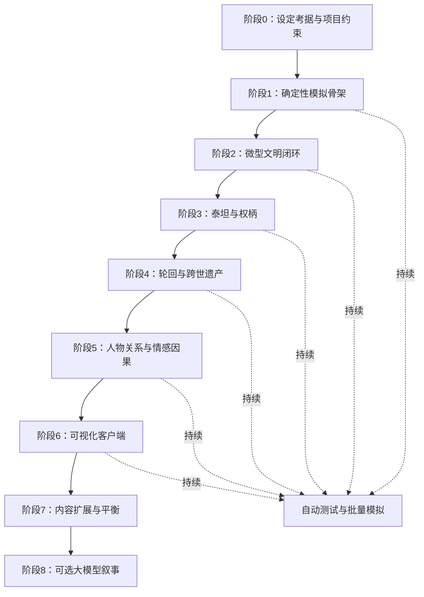

# 开发顺序与里程碑

状态：草案 0.1  
最后更新：2026-09-04

## 总体顺序图

大模型最后接入，不是因为它不重要，而是只有在事实模型稳定后，它才有可靠材料可表达。

## 阶段0：设定考据与约束（现在）

目标：把“忠实还原”变成可验证的规则清单。

交付物：

- 设定事实表：来源、版本、可信度、是否剧透；
- 泰坦—权柄—世界规则映射；
- 逐火与轮回的已知条件、未知项和解释空间；
- 原作事实与项目原创补全严格分栏；
- IP素材与贡献规范草案。

退出条件：能够选定三种权柄和一个末日威胁，且不会因为设定争议推翻整个内核。

## 阶段1：确定性模拟骨架

目标：建立以后不会反复推倒的技术地基。

实现：

- 固定步长时钟；
- 实体ID与组件数据；
- 隔离随机流；
- 命令输入记录；
- 结构化事件日志；
- 快照、读档和回放；
- 命令行无头运行；
- 确定性回归测试。

退出条件：同一版本、种子和命令日志运行100次，最终状态哈希完全一致。

## 阶段2：微型文明闭环

目标：在没有泰坦和轮回时，世界已经可以自行生存和毁灭。

实现：地图、人口组、资源、聚落、迁徙、合作、冲突和简单灾害。

退出条件：世界可连续运行至少100个游戏年；存在繁荣、僵持和崩溃等不同终态；重大变化可以解释。

## 阶段3：泰坦与权柄

目标：证明泰坦是可转移的规则实体，而不是Boss模板。

实现：权柄、人格、载体分离；权柄持有、空缺、转移、分裂；三种世界规则修正。

退出条件：杀死、封印、继承同一泰坦会产生三种系统性不同的后果。

## 阶段4：轮回与遗产

目标：完成第一个核心游戏循环。

实现：末日判定、终态向量、遗产候选、有限选择、有损继承、第二世初始化。

退出条件：第二世因为第一世遗产出现统计显著且人类可观察的差异，而不是只更换姓名。

## 阶段5：人物关系与情感因果

目标：让玩家关心模拟中的人。

实现：人物晋升、关系、记忆、誓言、创伤、牺牲、见证和历史传播。

退出条件：小规模盲测中，测试者能在不看内部数值的情况下复述一个人物故事及其因果。

## 阶段6：可视化客户端

目标：让玩家看懂并介入模拟。

实现：地图、时间控制、人物关注、事件流、因果链、轮回对照及基础干预。

退出条件：新测试者无需开发者解释，能完成一次观察—干预—轮回—回看流程。

## 阶段7：内容扩展与平衡

目标：逐步提高对原作设定的覆盖，而不破坏核心规则。

实现：更多泰坦、城邦文化、灾变、人物原型、事件模板和模组接口；通过成百上千局无头模拟检查系统支配性与死局。

## 阶段8：可选大模型叙事

目标：提高表达变化度，而不改变事实。

实现：统一叙事接口、提示词版本、事实约束校验、模板/本地/在线三后端、缓存与隐私说明。

退出条件：关闭模型不影响玩法；模型文本中的人名、关系、时间和结果均能由事件数据验证。

## 当前最近的三个迭代

### Iteration 0：规则纸面原型

预计：3～7天。

- 完成设定事实表模板；
- 选定三种占位权柄；
- 手工推演两座城邦20回合；
- 检查是否能产生至少三条不同历史；
- 固化首版数据字段。

### Iteration 1：命令行模拟内核

预计：1～2周。

- 创建工程与测试框架；
- 完成时钟、随机数、实体、事件和状态哈希；
- 输出纯文本历史；
- 支持种子复现。

### Iteration 2：文明最小闭环

预计：2～4周。

- 资源生产与消耗；
- 人口变化和迁徙；
- 两城邦关系与冲突；
- 单一扩散型灾害；
- 批量模拟统计。

## 开工闸门

在选择编程语言和引擎前，先回答：

1. 首个原型是否需要立即显示地图，还是接受先做命令行？
2. 第一批严格考据的三位泰坦是哪三位？
3. 设定覆盖以原作哪个版本/章节为边界？
4. 仓库是否公开包含剧透内容，是否需要剧透分区？

其中第1项建议选择“先做命令行”；其他问题不会阻止技术骨架开工。

