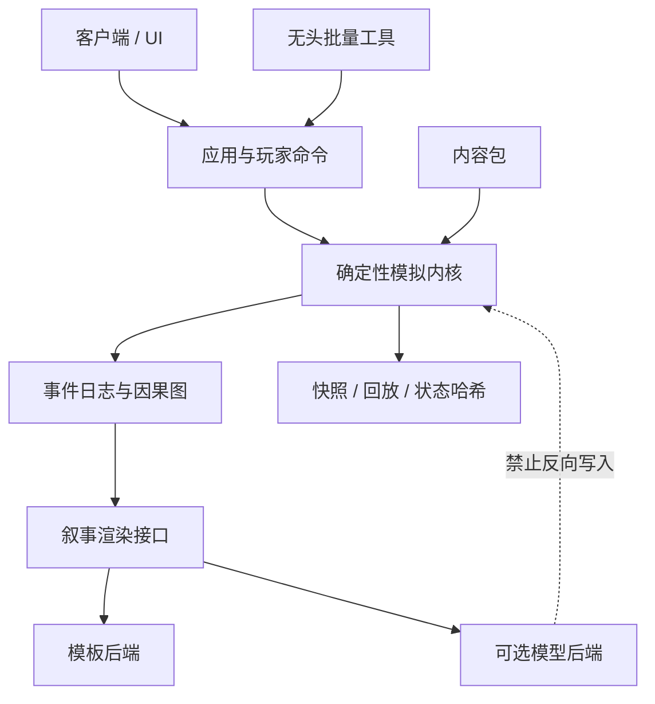

# 技术架构草案

状态：草案 0.1  
最后更新：2026-09-04

## 架构目标

- 确定性：相同版本、种子和输入得到相同结果；
- 可解释：重大状态变更能追溯原因；
- 可批量运行：模拟不依赖画面；
- 数据驱动：内容贡献尽量无需修改内核；
- 可替换：翁法罗斯内容、客户端和叙事后端互不绑死；
- 可长期存档：为数据迁移预留版本字段。

## 模块依赖



## 更新模型

采用固定逻辑步长。画面帧率不得改变模拟结果。建议初期一个逻辑 tick 表示一天或更抽象的时间单位；战斗等短时行为可使用局部阶段，而不是提升整个世界频率。

单个 tick 的概念顺序：

1. 接收并校验玩家命令；
2. 更新世界环境；
3. 计算文明需求与计划；
4. 计算人物计划；
5. 统一解决冲突；
6. 应用权柄修正；
7. 提交状态变化；
8. 生成事件和因果引用；
9. 检查末日、终态与轮回条件；
10. 可选生成快照与状态哈希。

计划与提交分离，避免实体遍历顺序决定胜负。

## 数据原则

- ID永不复用；
- 状态数据不保存显示文本；
- 浮点运算需谨慎，核心结算优先使用整数或定点数；
- 字典/集合遍历必须显式排序；
- 内容配置必须有 schema 和版本；
- 所有存档包含引擎版本、内容包版本、种子和命令日志摘要。

## 建议目录（实现时）

```text
src/
  core/          时间、实体、随机流、事件、状态
  systems/       世界、文明、人物、权柄、轮回
  application/   玩家命令和用例
  narrative/     模板与可选模型接口
  client/        地图和界面
content/
  amphoreus/     翁法罗斯内容包
schemas/         配置和存档格式
tests/
  unit/
  determinism/
  simulation/
tools/
  batch-runner/
  history-viewer/
docs/
```

目录仅是边界建议，具体布局随技术选型调整。

## 技术选型建议

当前优先建议：

- 原型内核：C#/.NET；
- 客户端：Godot + C#；
- 内容：JSON/YAML 二选一，进入实现前确定；
- 测试：单元测试 + 状态快照 + 多种子统计测试。

理由：C#适合强类型领域模型和无头测试，同时可直接用于Godot客户端。若主要贡献者更熟悉 Rust、TypeScript 或 GDScript，可以重新评估；不能只因引擎方便就让核心模拟依赖场景树。

## 必须优先验证的技术风险

1. 跨平台是否能保持确定性；
2. 事件日志在长局中是否膨胀；
3. 因果引用是否足够解释重大事件；
4. 大量人口使用分级模拟后是否仍产生可信结果；
5. 规则热更新和内容模组是否破坏存档兼容。

